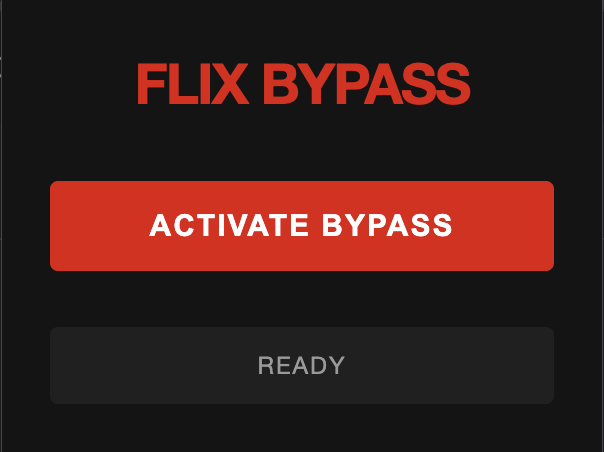
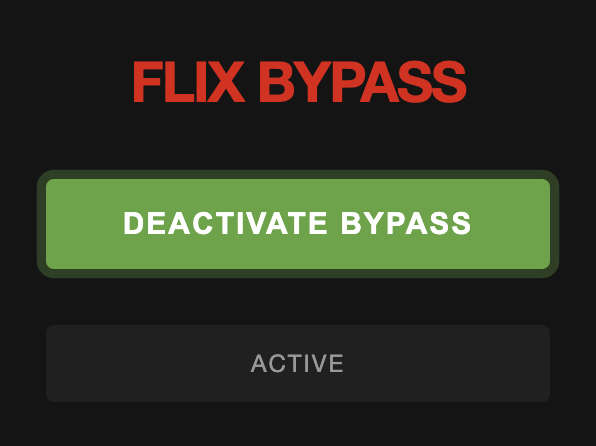

# 🎬 Flix Bypass

Belirli çerezleri geçici olarak değiştirerek Netflix kısıtlamalarını aşan bir Chrome uzantısı.

[🇺🇸 English Documentation](./README.md)

## 📋 Özellikler

- ✨ **Otomatik Mod**: Netflix içeriklerine göz atarken otomatik olarak aktif olur
- 🍪 **Çerez Yönetimi**: `SecureNetflixId` çerezini geçici olarak değiştirir
- 🎯 **Akıllı Algılama**: `/watch` ve `/browse` sayfalarında çalışır
- 🔄 **Otomatik Geri Yükleme**: Bypass sonrası orijinal çerez değerlerini otomatik geri yükler
- 🎨 **Netflix Temalı Arayüz**: Netflix tasarımıyla uyumlu modern ve temiz arayüz
- ⚡ **Hızlı ve Hafif**: Minimum kaynak kullanımı

## 🚀 Kurulum

### Yöntem 1: Manuel Kurulum (Geliştirici Modu)

1. Bu depoyu klonlayın veya indirin:
```bash
git clone https://github.com/kullaniciadi/flix-bypass.git
```

2. Chrome'u açın ve `chrome://extensions/` adresine gidin

3. **Geliştirici modu**'nu etkinleştirin (sağ üst köşedeki anahtar)

4. **Paketlenmemiş yükle**'ye tıklayın

5. `flix-bypass` klasörünü seçin

6. Uzantı simgesi Chrome araç çubuğunuzda görünmelidir

### Yöntem 2: Sürükle ve Bırak

1. Chrome'u açın ve `chrome://extensions/` adresine gidin
2. **Geliştirici modu**'nu etkinleştirin
3. Tüm klasörü uzantılar sayfasına sürükleyip bırakın

## 📸 Ekran Görüntüleri

<div align="center">

### Uzantı Popup - Pasif Durum


### Uzantı Popup - Aktif Durum


</div>

## 🎮 Kullanım

1. **Netflix'e Gidin**
   - [netflix.com](https://netflix.com) adresine gidin
   - Herhangi bir içerik sayfasına veya izleme sayfasına gidin

2. **Bypass'ı Etkinleştirin**
   - Flix Bypass uzantı simgesine tıklayın
   - **"Activate Bypass"** düğmesine tıklayın
   - Düğme aktif olduğunda yeşile döner

3. **İçeriğin Keyfini Çıkarın**
   - Uzantı gerektiğinde otomatik olarak çalışacaktır
   - Orijinal çerezler bypass sonrası geri yüklenir

4. **Devre Dışı Bırakın** (İsteğe Bağlı)
   - Uzantı simgesine tekrar tıklayın
   - Kapatmak için **"Deactivate Bypass"** düğmesine tıklayın

## 📁 Proje Yapısı

```
flix-bypass/
├── manifest.json      # Uzantı yapılandırması
├── background.js      # Arka plan servis çalışanı
├── popup.html        # Uzantı popup arayüzü
├── popup.js          # Popup işlevselliği
├── logo.png          # Uzantı simgesi
└── README.md         # Dokümantasyon
```

## 🔧 Nasıl Çalışır?

1. **Algılama**: Uzantı Netflix sayfalarını belirli desenler için izler
2. **Çerez Değişikliği**: Tetiklendiğinde, `SecureNetflixId` çerezini geçici olarak değiştirir
3. **Düğme Tıklama**: Oynat/devam et düğmesine otomatik olarak tıklar
4. **Geri Yükleme**: 3 saniye sonra orijinal çerez değeri geri yüklenir

## ⚙️ Teknik Detaylar

### Gerekli İzinler

- `cookies` - Netflix çerezlerini okumak ve değiştirmek için
- `activeTab` - Mevcut sekmeyle etkileşim kurmak için
- `storage` - Uzantı ayarlarını kaydetmek için
- `webNavigation` - Sayfa navigasyonunu algılamak için
- `scripting` - Script enjekte etmek ve elementlere tıklamak için
- `host_permissions: <all_urls>` - Netflix domainlerinde çalışmak için

### Kullanılan Teknolojiler

- Chrome Extension Manifest V3
- JavaScript (ES6+)
- Chrome Storage API
- Chrome Cookies API
- Chrome Scripting API

## 🛡️ Gizlilik ve Güvenlik

- **Veri Toplama Yok**: Bu uzantı hiçbir kullanıcı verisi toplamaz, saklamaz veya iletmez
- **Yerel İşlem**: Tüm işlemler tarayıcınızda yerel olarak gerçekleştirilir
- **Geçici Değişiklikler**: Çerez değişiklikleri geçicidir ve otomatik olarak geri alınır
- **Harici Bağlantı Yok**: Uzantı hiçbir harici sunucuyla iletişim kurmaz

## ⚠️ Sorumluluk Reddi

Bu uzantı yalnızca **eğitim amaçlıdır**. Kullanıcılar Netflix Kullanım Koşulları'na uymaktan sorumludur. Geliştiriciler, hizmet şartlarının herhangi bir kötüye kullanımından veya ihlalinden sorumlu değildir.

## 🐛 Sorun Giderme

### Uzantı Çalışmıyor mu?

1. Uzantının **etkinleştirildiğinden** emin olun (düğme yeşil olmalı)
2. Netflix sayfasını yenileyin
3. `/watch` veya `/browse` sayfasında olduğunuzdan emin olun
4. Uzantıyı devre dışı bırakıp tekrar etkinleştirmeyi deneyin

### Düğme Tıklanmıyor mu?

- Uzantı belirli düğme sınıflarını arar
- Netflix arayüzünü güncelleyebilir, bu da işlevselliği etkileyebilir
- Önce düğmeye manuel olarak tıklamayı deneyin

### Çerezler Değişmiyor mu?

- Diğer uzantıların müdahale edip etmediğini kontrol edin
- Netflix'e giriş yaptığınızdan emin olun
- Tarayıcı önbelleğinizi temizleyin ve tekrar deneyin

## 🤝 Katkıda Bulunma

Katkılar hoş karşılanır! Şunları yapabilirsiniz:

- Hataları bildirin
- Yeni özellikler önerin
- Pull request gönderin
- Dokümantasyonu geliştirin

## 📄 Lisans

Bu proje eğitim amaçlı olduğu gibi sağlanmaktadır.

## 👨‍💻 Geliştirici

Öğrenme amaçlı ❤️ ile geliştirildi

---

**Not**: Bu uzantı Netflix ile hiçbir şekilde bağlantılı, onaylanmış veya ilişkili değildir.

